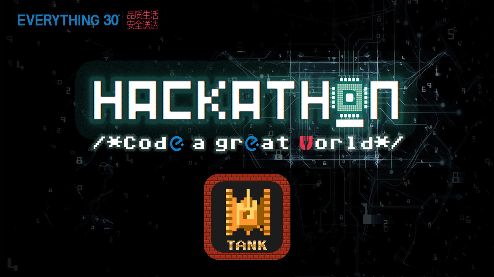
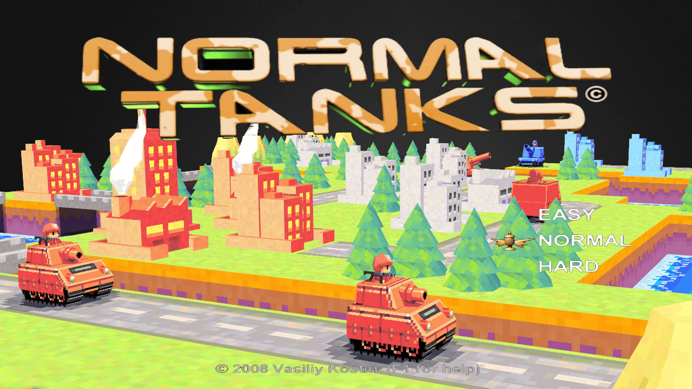

#【2017 饿了么黑客马拉松】 初赛第二题


## [饿了么-百度外卖 2017 黑客马拉松](https://hackathon.ele.me/?introduce.html) 初赛第二题 Tank 大战


<p align='center'>

</p>


## 比赛形式：
1. 比赛采取循环赛制，即每组队伍循环和其他队伍进行两两对战，单局比赛获胜方得3分，败者得0分，平局各得1分。最终获得分数高的队伍获胜。
2. 组委会提供5张对战地图。第一个星期一张（公开），第二个星期一张（公开），最后一天提供三张（不公开）。最终单局比赛成绩取**最后一天**两只队伍在**5张地图**上的对战结果计算，每局比赛胜利算一分，最终分数高的获胜。然后各个队伍间按循环赛积分进行排名。
3. 前期的比赛只公布各团队的积分，对对战过程进行保密。

## 比赛细节描述:
1. 地图大小为N*N（每张地图可能大小不一致），中心旋转对称，队伍的tank出生在地图的两个对边角上。
2. 地图上有以下元素（但是不保证所有的元素在每一张地图中都会出现）
    1. 障碍物，不可被摧毁。地图的最外围会被一圈障碍物覆盖。
    2. 战旗，始终固定在地图中心出现。可被经过的tank获得。战旗消失后会在固定回合后重新出现。
    3. 森林，处于森林中的tank不会被敌方发现。处于森里中的炮弹对双方均不可见。
3. 每只队伍M量tank。
4. 每辆tank在地图上最多只能存在一发炮弹。必须在之前发射的炮弹消失掉之后才能进行开火的操作。
5. tank可以进行如下操作：左转，右转，掉头，前进，原地不动，开火。开火方向可以和坦克的行进方向不一样。开火方向限制在上下左右四个方向（**_游戏中所有的方向均以地图为基准_**，即向左转向会转到地图向左的方向，而不是tank自己的左方。）。每个回合只能执行一个操作。前进只能走完tank速度的全程。
6. tank速度为x，炮弹速度为y，其中x<y。
7. 炮弹之间不能互相抵消，炮弹不区分敌我。
8. tank有H格血量，每发炮弹只能打掉tank一格血量。
9. 炮弹具有最高优先结算权，即游戏首先结算炮弹的行进，然后再结算tank的开火，最后结算行进和移动操作。如果炮弹击毁一辆tank，此辆tank将不具有进行下一步操作的权利。炮弹命中tank或障碍物之后炮弹即消失。多发炮弹命中同一量坦克后，所有炮弹全部消失，即使被命中的tank只有一滴HP。tank行进路上遭遇炮弹会被判定为被击中。
10. 同一坐标不允许有两辆tank存在，即两辆tank的下一步操作导致进入相同坐标，这两辆tank的位置停留在进入相同坐标前的位置。例如，如果两辆坦克行进两格后会处于同于位置，则两辆坦克各自行进一格。
11. 单场地图比赛获胜条件：
	A）在限定的回合当中，一方的坦克被全部击毁则游戏结束，幸存的一方获胜。
	B）在限定的回合结束后，双方均有坦克存留，按以下方式结算：
    1. 每辆剩余的tank获得i分
    2. 每一面获取的战旗得j分
    3. i+j分数高的一方获胜

## 游戏引擎设计：
1. 参赛选手的程序和判题程序通过thrift协议交互。idl定义在 src/main/resources/player.idl中。
2. 参赛选手的程序部署在独立的docker上，并启动相应的thrift服务。
3. 游戏初始，判题程序向参赛双方提供如下数据：地图，每辆坦克的属性
4. 之后判题程序工作于询问模式，每回合询问参赛双方一次操作指令，然后对操作指令进行结算，并将结算结果返回参赛双方，并进入下一回合。
5. 每回个超时时间为s毫秒，如果超时则视参赛方tank不进行任何操作。
6. 比赛最多进行t回合。如果t回合之前一方tank全部被击毁，游戏结束。

## 选手程序设计
1. 参赛选手的程序需要实现src/main/resources/player.idl中定义的服务，并启动在80端口上。
2. 参赛选手需要自己订制docker容器，启动脚本为 /data/start.sh

为了保证比赛的公平性以及区分度，组委会保留对以上描述中的变量（n,m,x,y,h,i,j,t）进行临时调整的权利。大致范围如下
N<30,M<5, X<Y<=4, h<4, i=j, t<=200, s<=2000ms


<p align='center'>

</p>


## 构建

1.由于比赛需要2名玩家，所以本地要先构建出2名玩家的 server。项目文件夹下有2个文件夹，一个是8080，另一个是8081，分别代表2名玩家。分别进入到2个文件夹下，执行

```go

go build server.go


```

编译出最新的 server 的可执行文件。

注：比赛由于需要提交 80 端口的程序，运行在 Docker 内。所以在 Mac 上需要交叉编译 Linux 平台，编译命令 ：

```go

GOOS=linux GOARCH=amd64 go build server.go

```

至于 Docker 打包成 image 的步骤见另外 repo 内另外一份 [docker文档](./docker.md)

2.

# Triplore

2017 年[爱奇艺最强开发者大赛](https://www.nowcoder.com/activity/iqiyi2017)项目

项目名 __Triplore__ 指 __Trip__ + __Explore__ ，即旅游 + 探险，希望用户能从网络上浩如烟海的的旅游视频之中抽丝剥茧，找到自己想要的信息。并且快速便捷地把这些信息记录、整合，制作成一张自己专属的旅游笔记，以便旅游时查阅。  

# 预览
<table>
    <tr>
        <td></td>
        <td></td>
        <td></td>
        <td></td>
        <td></td>
    </tr>
</table>

# 功能介绍

### 视频模块

##### 列表

1. 首页精选旅游视频，为用户提供旅游灵感。

2. 可以按关键词搜索爱奇艺全网中与旅游相关的视频。

3. 提供热门 __旅游国家、城市或地区__ 的列表，让用户根据自己的旅游目的地来寻找需要的视频。每个城市下又分为 __美食__ 、 __购物__ 、 __景点__ 三个模块，这是旅游爱好者对目的地最感兴趣的信息。用户可以直接点击进入查看相关视频列表。

4. 可以将视频添加到自己的 __收藏夹__ ，以供日后翻阅。

5. 在视频列表中可以 __上拉刷新__ ，以分页式进行视频获取。

6. 会保存用户的 __观看历史__ ，帮助用户找到之前观看过却记不住名字的视频。

##### 播放

1. 播放视频时，可以横放手机来 __全屏__ 观看，以获得更好的用户体验。竖放与横放均有 __进度条__ 。

2. 在视频播放区域的左半部分和右半部分可以通过 __上下滑动__ 分别调节亮度和音量。
 
3. 在播放界面有一个可拖动的 __控制面板__ ，具体功能请见下。

### 笔记模块

1. 在播放视频（横屏、竖屏均可）时，可以利用控制面板来随时 __添加文字笔记__ 或者 __对视频截图__ ，将它们拼接，形成一张旅游笔记。可以选择不同 __模板__ 和 __字体__ （均为免费商用授权）对笔记进行个性化修饰，可以为笔记添加标题。用户制作的笔记均保存在本地。

2. 在播放视频时，可以按控制面板中的录制按钮对视频进行 __录制__ ，并保存该段视频到相册。这样可以将视频中较为连续的有用信息存放至手机里，旅游时查看更加方便。
    
    *注：视频版权归原作者/爱奇艺所有，录制到本地的视频仅供个人观看使用，不可作任何商业用途。*

3. 对笔记进行统一管理，可以删除笔记或者修改笔记详情，包括 __左滑删除__ 笔记某一项、 __点击编辑__ 文字笔记的内容、 __长按调整__ 笔记内容的顺序等。如果查阅笔记时觉得有内容需要补充，可以直接进入该笔记对应的视频播放页面，对笔记进行修改。

4. 可以将笔记生成 __高清图片__ 保存至相册，以供打印或者日后查阅。

5. 我们拥有一套用户系统。当用户进行 __注册、登录__ 后，可以选择对笔记进行 __分享__ ，即上传到服务器，其他用户可以在线查看别人的笔记，进行 __点赞__ 、 __收藏__ ，或 __下载到本地__ ，进行二次修改后保存。

# 安装步骤

**注：强烈建议真机测试，模拟器会出现较多问题**

1. 下载项目。

2. 由于其中一个所需的库 `libav.a` [🔗下载地址](http://pan.baidu.com/s/1gfxfyc7)  太大（解压后 `1.86 GB`），所以仓库中并不包含它，在项目中需要手动将它拖到 `Triplore/IOSPlayerLib` 中。完成后项目目录（省略细节文件）如下：
    
    ```
    .
    ├── IOSPlayerLib
    │   ├── include
    │   └── libav.a     <------ 放到这里
    ├── Podfile
    ├── Podfile.lock
    ├── Pods
    ├── Triplore
    ├── Triplore.xcodeproj
    ├── Triplore.xcworkspace
    └── TriploreTests
    ```  

3. 开启 `Triplore.xcworkspace`，按 `Cmd + R` 运行项目。

#### 可能出现的问题

* 若出现与特定第三方库相关的错误，尝试在 `TARGETS -> Triplore -> Build Phases -> Link Binary With Libraries` 中添加对应 `Pod` 库的 `.a` 文件。

* 若出现 `Invalid Bitcode Signing`, 请到最左边 `Pods -> 每一个 Target -> Build Settings` 中搜索 `Bitcode` 将 `Enable Bitcode` 设为 `NO`。

* 若提示找不到 `libav.a`，在项目的 `TARGETS -> Triplore -> General -> Linked Frameworks And Libraries` 中手动添加本地路径的 `libav.a`。

# 其它

感谢以下第三方库及平台（按首字母排序）

*   [AFNetworking](https://github.com/AFNetworking/AFNetworking)
*   [DZNEmptyDataSet](https://github.com/dzenbot/DZNEmptyDataSet)
*   [FMDB](https://github.com/ccgus/fmdb)
*   [LeanCloud](https://leancloud.cn) 
*   [MJRefresh](https://github.com/CoderMJLee/MJRefresh)
*   [PYSearch](https://github.com/iphone5solo/PYSearch)
*   [SDCycleScrollView](https://github.com/gsdios/SDCycleScrollView)
*   [SDWebImage](https://github.com/rs/SDWebImage)
*   [SVProgressHUD](https://github.com/SVProgressHUD/SVProgressHUD)
*   [TYPagerController](https://github.com/12207480/TYPagerController)

# 作者

Produced by [halfrost](https://github.com/halfrost)、[mmoaay](https://github.com/mmoaay) and [EyreFree](https://github.com/EyreFree).

