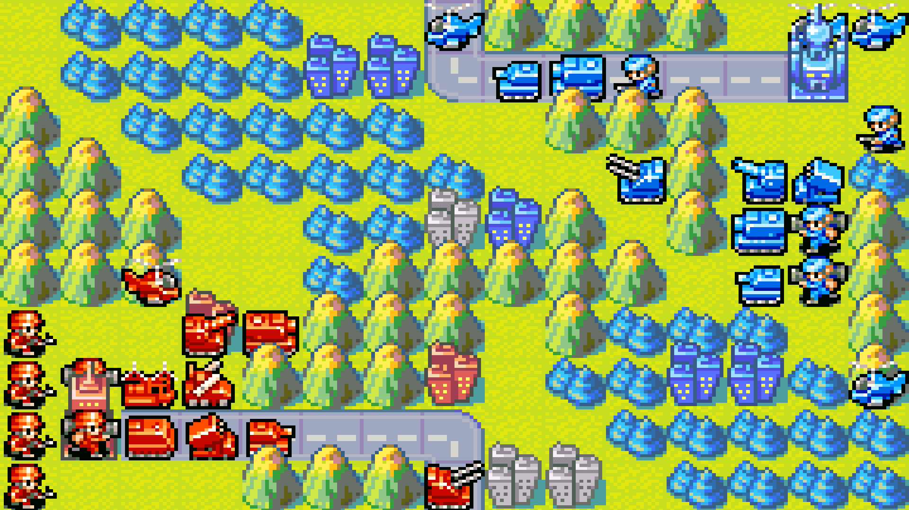
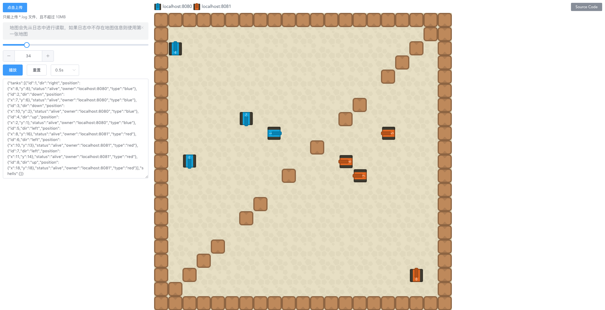

# [饿了么-百度外卖 2017 黑客马拉松](https://hackathon.ele.me/?introduce.html) 初赛第二题 Tank 大战


<p align='center'>

</p>


## 比赛形式
1. 比赛采取循环赛制，即每组队伍循环和其他队伍进行两两对战，单局比赛获胜方得3分，败者得0分，平局各得1分。最终获得分数高的队伍获胜。
2. 组委会提供5张对战地图。第一个星期一张（公开），第二个星期一张（公开），最后一天提供三张（不公开）。最终单局比赛成绩取**最后一天**两只队伍在**5张地图**上的对战结果计算，每局比赛胜利算一分，最终分数高的获胜。然后各个队伍间按循环赛积分进行排名。
3. 前期的比赛只公布各团队的积分，对对战过程进行保密。


## 比赛细节描述

<p align='center'>

</p>

1. 地图大小为N*N（每张地图可能大小不一致），中心旋转对称，队伍的tank出生在地图的两个对边角上。
2. 地图上有以下元素（但是不保证所有的元素在每一张地图中都会出现）
    1. 障碍物，不可被摧毁。地图的最外围会被一圈障碍物覆盖。
    2. 战旗，始终固定在地图中心出现。可被经过的tank获得。战旗消失后会在固定回合后重新出现。
    3. 森林，处于森林中的tank不会被敌方发现。处于森里中的炮弹对双方均不可见。
3. 每只队伍M量tank。  
4. 每辆tank在地图上最多只能存在一发炮弹。必须在之前发射的炮弹消失掉之后才能进行开火的操作。  
5. tank可以进行如下操作：左转，右转，掉头，前进，原地不动，开火。开火方向可以和坦克的行进方向不一样。开火方向限制在上下左右四个方向（**游戏中所有的方向均以地图为基准**，即向左转向会转到地图向左的方向，而不是tank自己的左方。）。每个回合只能执行一个操作。前进只能走完tank速度的全程。
6. tank速度为x，炮弹速度为y，其中x<y。
7. 炮弹之间不能互相抵消，炮弹不区分敌我。
8. tank有H格血量，每发炮弹只能打掉tank一格血量。
9. 炮弹具有最高优先结算权，即游戏首先结算炮弹的行进，然后再结算tank的开火，最后结算行进和移动操作。如果炮弹击毁一辆tank，此辆tank将不具有进行下一步操作的权利。炮弹命中tank或障碍物之后炮弹即消失。多发炮弹命中同一量坦克后，所有炮弹全部消失，即使被命中的tank只有一滴HP。tank行进路上遭遇炮弹会被判定为被击中。
10. 同一坐标不允许有两辆tank存在，即两辆tank的下一步操作导致进入相同坐标，这两辆tank的位置停留在进入相同坐标前的位置。例如，如果两辆坦克行进两格后会处于同于位置，则两辆坦克各自行进一格。
11. 单场地图比赛获胜条件：
	A）在限定的回合当中，一方的坦克被全部击毁则游戏结束，幸存的一方获胜。
	B）在限定的回合结束后，双方均有坦克存留，按以下方式结算：
    1. 每辆剩余的tank获得i分
    2. 每一面获取的战旗得j分
    3. i+j分数高的一方获胜


## 游戏方式


<p align='center'>

</p>


回合制。每回合敌我双方都有行动一次的机会。子弹先行动。

## 游戏引擎设计
1. 参赛选手的程序和判题程序通过thrift协议交互。idl定义在 src/main/resources/player.idl中。
2. 参赛选手的程序部署在独立的docker上，并启动相应的thrift服务。
3. 游戏初始，判题程序向参赛双方提供如下数据：地图，每辆坦克的属性
4. 之后判题程序工作于询问模式，每回合询问参赛双方一次操作指令，然后对操作指令进行结算，并将结算结果返回参赛双方，并进入下一回合。
5. 每回个超时时间为s毫秒，如果超时则视参赛方tank不进行任何操作。
6. 比赛最多进行t回合。如果t回合之前一方tank全部被击毁，游戏结束。

<p align='center'>

</p>


## 选手程序设计
1. 参赛选手的程序需要实现src/main/resources/player.idl中定义的服务，并启动在80端口上。
2. 参赛选手需要自己订制docker容器，启动脚本为 /data/start.sh

为了保证比赛的公平性以及区分度，组委会保留对以上描述中的变量（n,m,x,y,h,i,j,t）进行临时调整的权利。大致范围如下
N<30,M<5, X<Y<=4, h<4, i=j, t<=200, s<=2000ms


<p align='center'>

</p>


## 构建

1.由于比赛需要2名玩家，所以本地要先构建出2名玩家的 server。项目文件夹下有2个文件夹，一个是8080，另一个是8081，分别代表2名玩家。分别进入到2个文件夹下，执行

```go
go build server.go

```

编译出最新的 server 的可执行文件。

注：比赛由于需要提交 80 端口的程序，运行在 Docker 内。所以在 Mac 上需要交叉编译 Linux 平台，编译命令 ：

```go

GOOS=linux GOARCH=amd64 go build server.go

```

至于 Docker 打包成 image 的步骤见另外 repo 内另外一份 [docker文档](./docker.md)

2.执行 play\_game 文件夹下的 start\_play\_game.sh 文件，把游戏引擎跑起来。最终游戏输出的结果会存在  play\_game/data/logs 路径下。

3.上传 log 文件到[游戏回放网页](https://tank-replayer.faas.elenet.me/#/)观看游戏回放。[游戏回放网页](https://tank-replayer.faas.elenet.me/#/) 可能会变成内网访问。

游戏最终结果由于游戏引擎判出：

```

Game result: {
  "result" : "draw",
  "win" : null,
  "state" : "localhost:8080: 6,localhost:8081: 6",
  "reason" : ""
}


```


## 更改游戏参数

更改游戏参数和游戏地图都是在 start\_play\_game.sh 文件中进行更改的。

```

#! /bin/bash


exec java -cp ./data/client/tank.jar:./data/client/classes ele.me.hackathon.tank.GameEngine ./data/secondweekmap.txt 4 1 2 1 1 1 100 2000 localhost:8080 localhost:8081 2>&1  | tee ./data/logs/engine.log


```

依次说明一下参数：

./data/secondweekmap.txt 地图。目前在 ./play_game/data/ 路径下包含7张地图可以选择。

4 坦克数量  
1 坦克速度  
2 炮弹速度  
1 每辆坦克的血量格  
1 击毁坦克得分  
1 夺旗得分  
100 比赛最多进行的回合数  
2000 每回个超时时间毫秒  

依次更改上述的参数可以达到游戏选关和难度调整的目的。

7张地图依次是：


<p align='center'>

</p>

<p align='center'>

</p>


<p align='center'>

</p>

<p align='center'>

</p>

<p align='center'>

</p>

<p align='center'>

</p>


<p align='center'>

</p>

## 我方坦克策略

寻路：A* 寻路  

躲避：A* 自动判断。把子弹2回合以后的行径路线上标识为不可达。为何是2回合？因为坦克转向需要一回合，另外一个回合移动。所以要先预判2回合。

坦克角色分配：

第一辆坦克，“杀手”职业，追着敌方坦克打。  
第二辆坦克，“夺旗”职业，围着地图中心点周围 9 * 9 的格子徘徊。  
第三辆坦克，“辅助”职业，围着地图中心点周围四分之一地图大小徘徊。  
第四辆坦克，“猥琐”职业，专门躲在草丛中，放暗剑，在草丛中游走。  

这四辆坦克的重要性依次降低。最重要的就是第一辆。所以每死一辆坦克，职业都要进行重新排列，按照坦克编号重新编排一下职业。这里就会有职业转换的问题。  

第一辆坦克有可能找不到敌方的坦克，因为敌方都躲在草里。这时候，杀手就会开启“扫荡”模式，走到每个草丛前，朝着草丛开一枪就走人，换下个草丛，依次轮过去。  


# 作者

Produced by [halfrost](https://github.com/halfrost)、[mmoaay](https://github.com/mmoaay) and [EyreFree](https://github.com/EyreFree).

